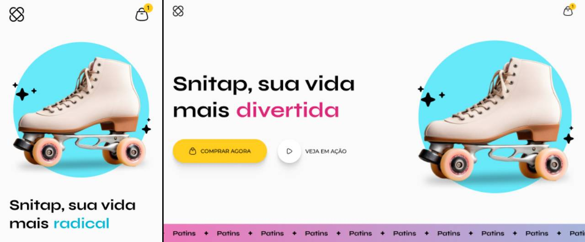

  <a href="#-tecnologias">Tecnologias</a>&nbsp;&nbsp;&nbsp;|&nbsp;&nbsp;&nbsp;
  <a href="#-projeto">Projeto</a>&nbsp;&nbsp;&nbsp;|&nbsp;&nbsp;&nbsp;
  <a href="#-layout">Layout</a>&nbsp;&nbsp;&nbsp;|&nbsp;&nbsp;&nbsp;
  <a href="#-contato">Contato</a>

 

  

## 💻 Projeto

Nesse projeto desenvolvi uma lading page de patins animados e com transições suaves.
- Veja o projeto: <a href="https://evelynnbr.github.io/Snitap/"> Snitap</a>

## 🚀 Tecnologias

Esse projeto foi desenvolvido com as seguintes tecnologias:

- HTML
- CSS

## 🧠 Conhecimentos

Com esse projeto, consegui aplicar meus conhecimentos em responsividade, Grid e Flexbox, e pude explorar os pseudo-elementos como ::before e ::after.

## 🔖 Layout

Você pode visualizar o layout do projeto através desse [link](https://www.figma.com/community/file/1379866810042169871/lp-de-patins-animada). É necessário ter conta no [Figma](https://figma.com) para acessá-lo.

## 😊 Contato

- Instagram:<a href="https://www.instagram.com/evelynnbr23/"> evelynnbr23</a>

- Linkedin:<a href="https://www.linkedin.com/in/evelynn-bezerra-ba5114260/"> Evelynn Bezerra
</a>

- WhatsApp: <a href="https://wa.me/5598984264190"> Me chame no whatsapp
</a>
